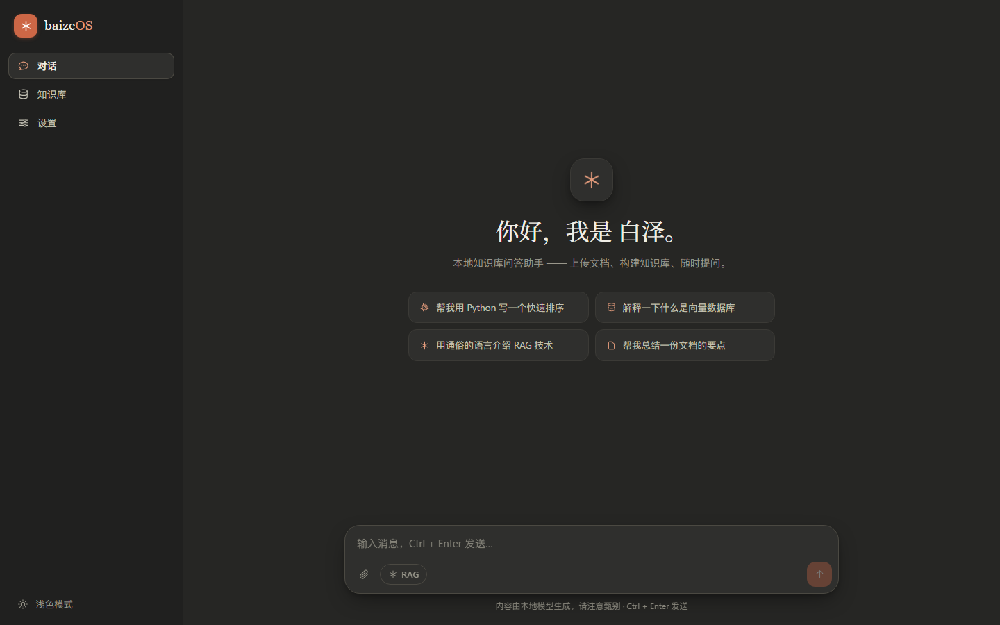
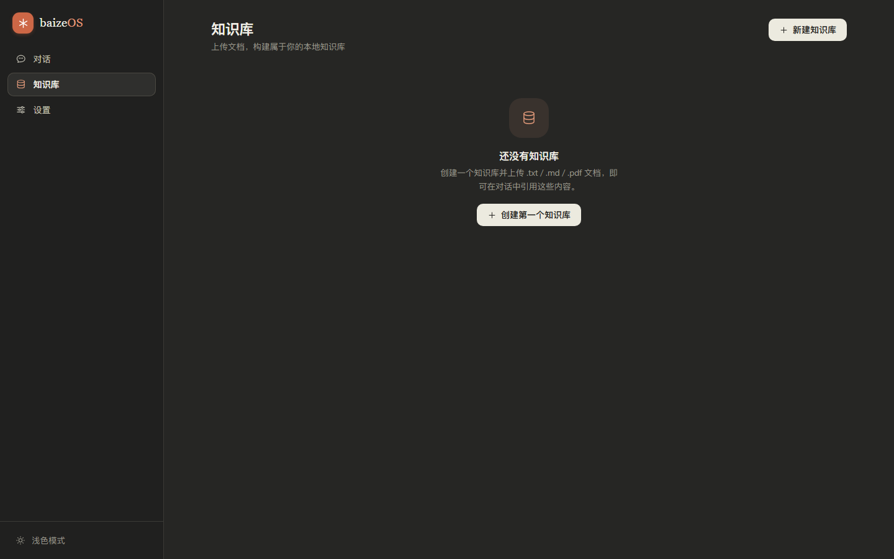
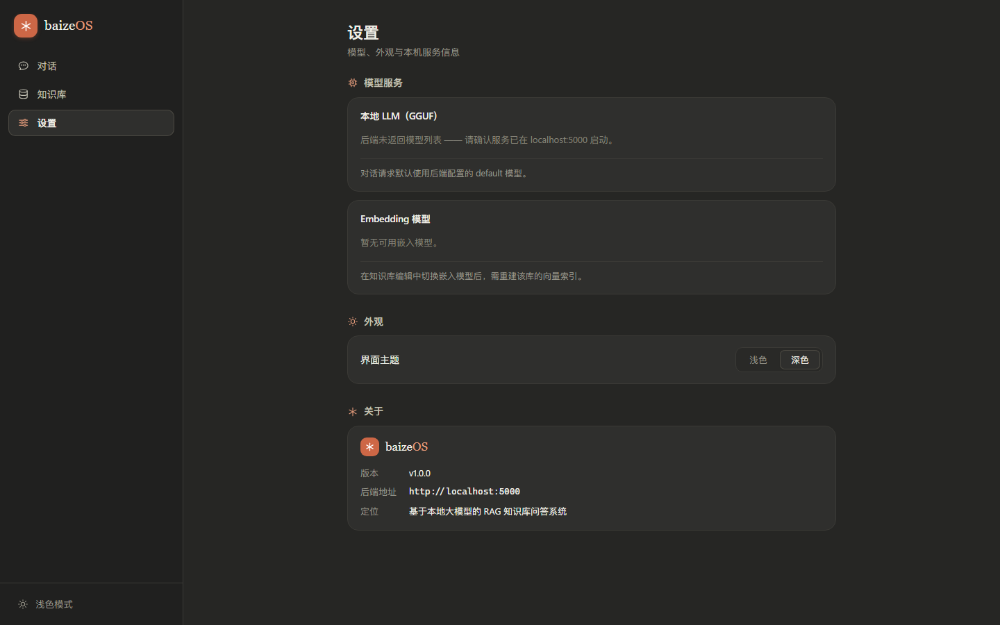

# baizeOS · 白泽

> **Run a RAG knowledge-base assistant on your own machine — fully offline, fully under your control.**
> baizeOS pairs a local GGUF LLM with a vector index over your `.txt` / `.md` / `.pdf` files, so every answer comes with the source passages it was grounded on.

[](./LICENSE)
[](#tech-stack)
[](#tech-stack)
[](#privacy)
[](../../stargazers)

<br>


<br>

## What is baizeOS?

baizeOS (白泽) is a single-user RAG workstation. The stack is deliberately small:

* A **Flask** backend that runs a GGUF model through `llama-cpp-python`, indexes documents with `FAISS`, embeds them with `sentence-transformers`, and streams chat completions over **Server-Sent Events**.
* A **Vue 3 + TypeScript** front-end with no UI component library — every control is hand-drawn so the visual language stays consistent.

The product follows three rules:

1. **Local-only.** No telemetry, no cloud round-trips, no API keys. Your documents and conversations never leave the box.
2. **Citable answers.** Every assistant turn is followed by a `references` block listing the exact chunks the model was given. If the index has no hit, the UI shows that explicitly — the model is never left to improvise.
3. **Design that doesn't shout.** Warm ivory background, a single terracotta accent, hairline borders, serif type reserved for the assistant's "voice". See [`DESIGN.md`](./DESIGN.md) for the full token set.

---

## Table of contents

- [Highlights](#highlights)
- [Screenshots](#screenshots)
- [Quick start](#quick-start)
- [Tech stack](#tech-stack)
- [Architecture](#architecture)
- [Project layout](#project-layout)
- [Frontend in depth](#frontend-in-depth)
- [API contract](#api-contract)
- [Roadmap](#roadmap)
- [Contributing](#contributing)
- [License](#license)

---

## Highlights

- 🔌 **One-command launch.** `python start.py` boots Flask on `:5000` and Vite on `:3000`, installs the frontend dependencies on first run, and opens the browser when both are ready.
- 📚 **Multiple knowledge bases.** Create as many KBs as you need, choose a different embedding model or system prompt per KB, and switch between them in the sidebar.
- 🧠 **RAG mode with built-in rerank.** RAG is a first-class toggle, not an afterthought — the SSE stream ends with `usage`, `references`, and `safety` frames that the front-end renders directly.
- 🖼 **Citable answers, visibly.** Each turn shows the source passages that were retrieved. A "no hit" state is shown when the index returns nothing, so you always know when the model is improvising.
- 🎨 **Hand-drawn UI, no framework.** Every icon is inline SVG, every modal is teleported, every dropdown supports full keyboard navigation. See [`frontend/src/ui/`](./frontend/src/ui).
- 🌗 **Light & dark, done right.** Both themes live on the same warm token set — no pure-black dark mode, no cold blue light mode.

---

## Screenshots

| Conversation | Knowledge base | Settings |
| :---: | :---: | :---: |
|  |  |  |

Full-resolution review captures live under [`.impeccable/review/`](./.impeccable/review).

---

## Quick start

### Prerequisites

* **Python ≥ 3.10** with [`uv`](https://docs.astral.sh/uv/) (recommended) or `pip`
* **Node.js ≥ 18** with `pnpm` (or `npm` / `yarn`)
* A **GGUF model** placed under `models/` — see [Backend setup](#backend-setup) below
* **OS:** Windows 10+, macOS 12+, or Linux

### One-shot launch

```bash
git clone https://github.com/Xtar7/baizeOS.git
cd baizeOS
python start.py          # Windows: double-click start.bat
```

`start.py` will:

1. Check `uv` and `node` availability.
2. Install the front-end dependencies on first run.
3. Start Flask on `localhost:5000` and Vite on `localhost:3000`.
4. Open the browser at <http://localhost:3000> when both are ready.
5. Tear down both processes on `Ctrl+C`.

### Manual launch

If you'd rather run the two halves separately:

```bash
# Backend (Flask :5000)
cd backend
uv run python app.py

# Front-end (Vite :3000, /v1 proxied to the backend)
cd frontend
pnpm install
pnpm dev
```

Production build of the front-end:

```bash
cd frontend
pnpm build              # vue-tsc -b && vite build → dist/
```

Drop the contents of `dist/` into Flask's static directory and the back-end will serve the SPA.

### Backend setup

1. Drop a GGUF model into `models/` (for example, `models/Qwen2.5-7B-Instruct-Q4_K_M.gguf`).
2. Drop a sentence-transformers embedding model into `models/` (for example, `models/bge-small-en-v1.5/`).
3. Edit `start.py` (or pass the path explicitly) so the back-end points at the right files. The defaults assume a single GGUF file and the `bge-small` family for embeddings.

If you don't have a model yet, the front-end will still come up and tell you the back-end is offline — useful when you only want to look around the UI.

---

## Tech stack

| Layer | Choice | Why |
|---|---|---|
| **LLM runtime** | `llama-cpp-python` | Pure C++ inference, CPU-friendly, GGUF-native. |
| **API** | Flask 3 | Tiny, readable, no magic. Streaming via generator responses. |
| **Vector index** | `faiss-cpu` | IndexFlatIP for the default small corpora; no server to run. |
| **Embeddings** | `sentence-transformers` | Local ONNX / PyTorch inference — no network. |
| **Front-end** | Vue 3 + TypeScript + Vite 7 | Composition API, `<script setup>`, full type safety. |
| **State** | Pinia 3 | `settings` (theme, toast, confirm promise), `kb`, `chat`. |
| **HTTP** | Axios 1.x for REST, `fetch` `ReadableStream` for SSE | Axios can't incrementally read a stream in the browser. |
| **Markdown** | `markdown-it` + `highlight.js` (16 languages on demand) | No client-side bundle bloat. |

---

## Architecture

```
┌────────────────────┐     SSE /v1/chat/completions      ┌────────────────────┐
│   Vue 3 SPA        │ ───────────────────────────────▶│   Flask backend    │
│   (localhost:3000) │                                  │   (localhost:5000) │
│                    │ ◀───  streamed delta tokens  ───│                    │
│  · ChatView        │                                  │  · /v1/chat        │
│  · KnowledgeView   │     REST  /v1/kb, /v1/files      │  · /v1/kb          │
│  · SettingsView    │ ───────────────────────────────▶│  · /v1/files       │
└────────────────────┘                                  │  · /v1/models      │
                                                          └────────┬───────────┘
                                                                   │
                                                          ┌────────▼──────────┐
                                                          │  llama-cpp-python  │
                                                          │  sentence-trans.   │
                                                          │  faiss-cpu         │
                                                          └────────────────────┘
```

Every chat turn goes through a single SSE response: `delta` events stream tokens, then a final `done` event carries `usage`, `references`, and `safety` metadata. The front-end reads the stream with `fetch` + `ReadableStream` and renders the references block the moment the stream closes.

---

## Project layout

```
baizeOS/
├─ start.py                 # one-shot launcher (Flask + Vite)
├─ start.bat                # Windows wrapper
├─ backend/                 # Flask + llama-cpp + FAISS
│  ├─ app/                  # routes, services, rag, ocr
│  ├─ data/                 # SQLite / on-disk state
│  └─ pyproject.toml
├─ frontend/                # Vue 3 SPA
│  ├─ src/
│  │  ├─ api/               # request, chat (SSE), kb, file, model
│  │  ├─ stores/            # Pinia: settings, kb, chat
│  │  ├─ types/             # mirrors docs/接口规范.md
│  │  ├─ ui/                # hand-drawn primitives (Icon, AppButton, ...)
│  │  ├─ components/        # SideBar, chat/*, kb/*
│  │  ├─ views/             # Layout, ChatView, KnowledgeView, KbDetailView, SettingsView
│  │  └─ style/             # tokens.css · base.css · markdown.css
│  └─ vite.config.ts
├─ docs/                    # API spec, design notes, screenshots
├─ KB/                      # (runtime) per-KB document storage
├─ models/                  # (runtime) GGUF + embedding models
├─ DESIGN.md                # design tokens & component contract
├─ PRODUCT.md               # product context
└─ LICENSE                  # MIT
```

---

## Frontend in depth

The front-end is fully typed, has **no** UI component library, and stays inside a tight visual budget:

- **`tokens.css`** is the single source of truth. Every color, radius, shadow and font-family lives there. Both light and dark themes share the same warm palette — only lightness changes.
- **`ui/Icon.vue`** renders the inline SVG icon set at runtime, 24-grid, 1.6 stroke, round caps, `currentColor`. No emoji, no Unicode substitutes.
- **`AppModal.vue`** is teleported, focus-trapped, scroll-locked, and Esc-dismissable. The confirm flow is a `Promise` via `settings.confirm()` so business logic stays declarative.
- **`AppSelect.vue`** supports full keyboard navigation (↑ ↓ Home End Esc) and flips upward when there's no room below.
- **`AppButton.vue`** ships four states (solid / soft / ghost / danger) and an inline spinner. Disabled while loading.
- **`style/markdown.css`** ships **two** palettes of `hljs` syntax highlighting — one for light mode, one for dark — derived from the same warm tokens.
- **The `RAG` chip is the only chroma in the sidebar** — once it's on, the chat header glows terracotta and the assistant's reply is followed by a `references` card.
- **The streaming caret** is a terracotta square that pulses 1s in / 1s out. Empty states get a slowly rotating brand mark on a 4.5s cycle — *"the local model is thinking"*.

For the full design system — every token, every component contract, every motion — see [`DESIGN.md`](./DESIGN.md).

---

## API contract

The REST + SSE contract is documented in [`docs/接口规范.md`](./docs/接口规范.md) and [`docs/API调用方案.md`](./docs/API调用方案.md). A few rules the front-end implements strictly:

1. **Upload form-data** uses `file` (singular) as the field name. KB uploads add `kb_id`; transient chat files add `chat_id`.
2. **DELETE with a JSON body.** Batch fields are plural: `kb_ids`, `kb_file_ids`.
3. **Transient file list / delete** are `POST /v1/files/list` and `POST /v1/files/delete` (not `GET` / `DELETE`).
4. **RAG chat** is `POST /v1/chat/completions` with `rag: true` and `kb_id`. The SSE stream ends with a final frame carrying `usage`, `references`, and `safety` — the front-end renders each.
5. **KB edits** that change the embedding model return `needs_rebuild: true`. The UI shows a "re-index" banner that fires `POST /v1/kb/{id}/reindex` on demand.

If you wire a new front-end or change a model, run `docs/API调用方案.md` end-to-end before shipping.

---

## Roadmap

- [x] Multiple knowledge bases with per-KB system prompt + embedding model
- [x] RAG mode with reference rendering and "no hit" empty state
- [x] Light / dark theme on the same warm token set
- [x] Inline SVG icon system, fully keyboard-navigable
- [ ] Multi-modal KB (images, scanned PDFs via OCR pipeline already in `backend/app/ocr`)
- [ ] Conversation export (Markdown / JSON)
- [ ] Optional retrieval-augmented reranker model
- [ ] Local web-search adapter (off by default)

---

## Contributing

PRs are welcome. The short version:

1. **Open an issue first** for anything beyond a one-line fix. The token set in [`DESIGN.md`](./DESIGN.md) and the API spec in [`docs/接口规范.md`](./docs/接口规范.md) are both load-bearing — changes to either need a heads-up.
2. **Run the build** before pushing:
   ```bash
   cd frontend && pnpm build           # vue-tsc + Vite, must be zero errors
   cd backend  && python -m py_compile $(find app -name "*.py")
   ```
3. **Match the existing style.** Vue components use `<script setup lang="ts">`. The back-end is plain Flask — no blueprints magic, no ORMs. Comments are sparse and in English; identifiers are descriptive.
4. **No new dependencies without a justification line in the PR.** The front-end and back-end are both small on purpose.

---

## License

[MIT](./LICENSE) — © 2026 Xtar. Use it, fork it, ship your own flavor.

<br>

<sub>baizeOS · 白泽 — "the one who knows the speech of ten thousand things."</sub>
